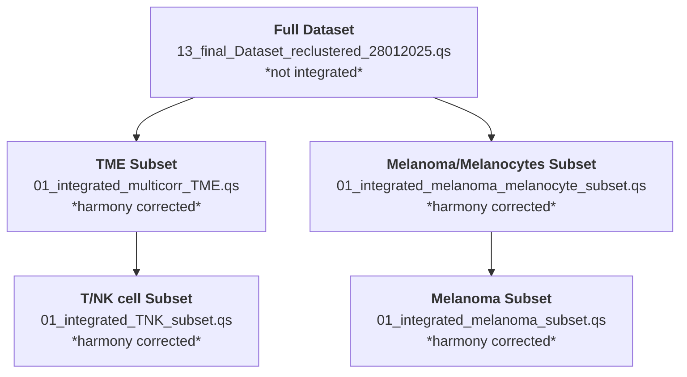

# UMscAtlas
Analysis of healthy, primary, and metastatic uveal melanoma using scRNA-seq and Xenium spatial transcriptomics. This repository includes workflows for preprocessing, integration, cell-type annotation, and characterization of malignant and TME states.

## Metadata variables documentation

| Metadata variable | Name in figure | Explanation |
| --- | --- | --- |
| primary_location  | Intraocular Location  | Location within the eye where the primary tumor arose. NA for samples that are not primary UM |
| origin | Disease Progression | Indicates if cells come from a healthy sample, primary tumor or metastasis |
| orig.ident | Sample | Identifies physical tissue sample cells originate from |
| location | Location | Location (intraocular location and location of metastasis) for all samples in the data set |
| samplename | Sample Name | Identifies biological replicates sequenced in different libraries (use instead of Sample column (that shows projectnumber and Index from FGCZ |
| healthy_location | Intraocular Location Healthy | Identifies intraocular location from healthy tissue |
| Condition | Batch | Indicates sequencing batch for each sample |
| primary_mutation | Primary Mutation | Identifies primary mutation (GNAQ, GNA11, PLCB4 or CYSLTR2) for each sample (assessed by WES or targeted sequencing) |
| secondary_mutation | Secondary Mutation | Identifies secondary mutation (BAP1, SF3B1 or EIF1AX) for each sample (assessed by WES or targeted sequencing) |
| Patient_nr | Patient Number | assigns a patient number (P1-P36) to each sequenced sample and shows which patients have multiple samples sequenced |
| organ | Organ | Identifies organ from which sample is originating |
| Gender | Gender | Identifies gender of patient sample was derived from |
| TreatmentStage_ofProcessedSample | Treatment | Indicates last treatment of patient before sampling of the sequenced sample |
| Stage_atDiagnosis | Stage at Diagnosis | Disease stage at first diagnosis |
| Mets_atDiagnosis | Metastasis at Diagnosis | Identifies if metastasis was present at disease prognosis |
| Age_atDiagnosisY | Age at Diagnosis | Identifies age at diagnosis of tumor in years |
| RiskCategory | Risk Category | Identifies risk category assigned by collaborators in Australia for primary tumors |
| Time_sinceDiagnosis | Time since Diagnosis | Shows calculated time since diagnosis in years until October 2025 |
| PrimaryTreatment | Primary Treatment | Identifies treatment of primary tumor |
| LocalProgressionPrimary | Local Progression Primary Tumor | Indicates wheter primary tumor showed disease progression or not |
| LocalProgressionTreatment | Treatment of Local Progression | Identifies which treatment was used if didease was locally progressive |
| DevelopmentOfMetastasis | Metastasis Development | Indicates whether disease developed into metastatic disease from primary tumor |
| Time_Primary-Met.Y | Time to Metastasis | Indicates time in years from primary tumor to metastasis development |
| MetastaticSite | Metastatic Site | Identifies site of metastasis development |
| MetastasisTreatment | Treatment Metastasis | Treatment of metastatic tumor |
| Time_sinceMetastasisDiagnosisY | Time since Diagnosis of Metastasis | Identifies time since diagnosis of metastasis in years until october 2025 |
| PatientStatus | Status Patient | Indicates whether patient is deceased or alive |
| LocationPrimaryTumor | Location of Primary Tumor | Identifies intaocular location of primary tumor also for metastases samples |

## Symbols to Use in Plots for h-p-m
- **healthy**: ● Circle (nr. 1)
- **primary**: ▲ Triangle (nr. 2)
- **metastases**: ◆ Diamond (nr. 5)

## Symbols to Use in Plots for primary mutation
- **GNAQ**: ● Circle (nr. 1)
- **GNA11**: ▲ Triangle (nr. 2)
- **PLCB4**: ◆ Diamond (nr. 5)
- **none**: ▼ Triangle, point down (nr. 6)
- **unknown**: ✵ Star (nr. 8)

## Available Datasets

- **Full Dataset**: All cells across all samples.
- **TME Subset**: Tumor microenvironment cells, subsetted from Full Dataset (all cells except Melanocytes and Melanoma cells).
- **Melanoma/Melanocytes Subset**: Melanoma cells and melanocytes from healthy - primary - metastases subsetted from Full Dataset.
- **Melanoma Subset**: Subset of melanoma cells from p-m UM samples subsetted from Full Dataset.

> **Notes:**
> - Melanoma cells were defined using inferred copy number variation (iCNV) profiles to distinguish malignant cells from non-malignant Melanocytes populations.
> - All subsets are **Harmony-corrected**, except the **Full Dataset**.

## Metadata Structure in Objects

Each Seurat object contains the following components:

#### 1. meta.data
Cell-level annotations and sample information:
- **`majority_celltype`**: Broad cell type annotation.
- **`SubTyping`**: Detailed immune cell subtypes.
- **`orig.ident`**: Original sample identifier (use for all analyses except GloScope).
- **`samplename`**: Library identifier.

> **Tip:** Refer to the summary table at the top and the provided R script for recommended naming conventions and color palettes.

---

#### 2. reductions
Dimensionality reduction results for visualization and integration:
- **`umap`**: UMAP coordinates for clustering and visualization.
- **`pca`**: PCA embeddings for exploratory analysis.
- **Integration**: All subsets are Harmony-corrected (except the Full Dataset).
-   use reduction: **`umap`** for **Full Dataset**
-   use reduction: **`umap_Condition_and_orig.ident_50PC_theta2`** for **Harmony-corrected Datasets**

---

#### 3. assays
Gene expression data:
- **`RNA`**: Normalized gene expression matrix (default assay for most analyses).

